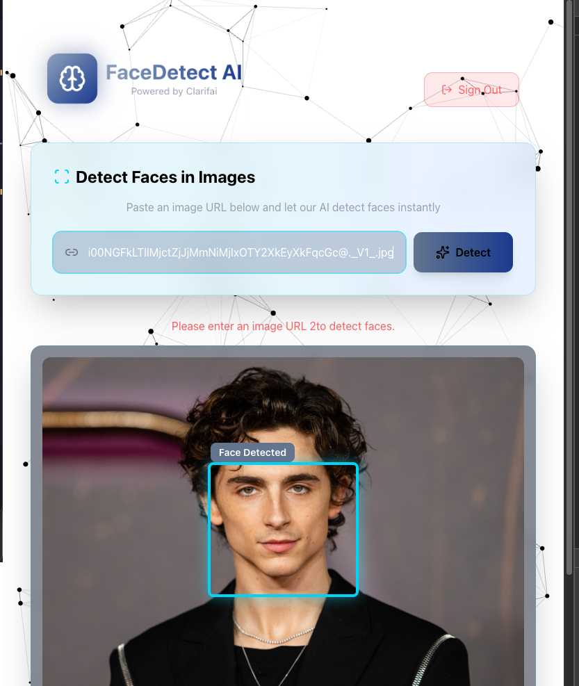

# React + Vite Face Recognition APP 

## Objective: Create an application with React + Vite that fetch data API from Clarifai AI Model "face-detection" AI model for detecting the location of human faces in images and video.
- https://clarifai.com/clarifai/main/models/face-detection?tab=overview
- https://github.com/chicacode/ai-face-recognition

## Project Requirements: 
1. Visual Aesthetic
- Light futuristic theme - Glassmorphism effects - Smoth over animations and transitions

2. React Features:
- Functional Components.
- Logo with Brain Icon - React Parallax Tilt Library.
- Background with Particles BG - npm package.
- Face Recognition - AI model integrated, Image display with rounded corners, animated ace detection, placeholder state when no image, and error handling for invalid URLs.
- Image Link Form - Large input field for image URL, "Detect" button with icon, helpful description text.
- Navigation - Top right position, Sign Out button when signed in.
- SignIn.
- Sign Out Button.

## Demo
1. Click "Sign In" button to see main app.
2. Enter an imae URL and click "Detect" to see face detection box.
3. Toggle between Sign In/Register.
4. Click Sign Out to outh screen

## Using Vite building
Vite uses the native ES modules feature in the browser to handle imports, while webpack and Parcel use a more traditional approach of bundling all the files together. This allows for faster development builds and hot module replacement with Vite
source - medium by Erbil Nas

## Tools
- React Js.
- Vite.
- Tailwind Css.
- React Parallax Tilt.
- Particles BG.
- React Router Dom.

● Hooks.
● Lifecycle methods.
● React Router (optional if your app is Single Page).

## App evolution

## References
- https://clarifai.com/clarifai/main/models/face-detection?tab=overview
- https://www.npmjs.com/package/particles-bg
- https://mkosir.github.io/react-parallax-tilt/?path=/story/react-parallax-tilt--parallax-effect-img
- https://docs.clarifai.com/compute/inference/clarifai/api-legacy/#predict-via-url

## Responsiveness
Website should work on both web and smartphone sizes

## Developed by: Geri
